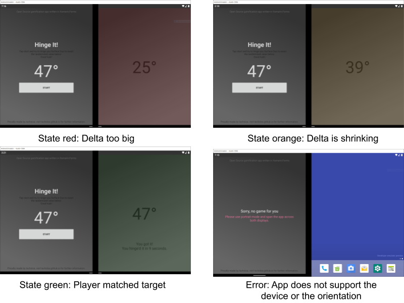

# Hinge It! - The Microsoft Surface Duo game
> This [Xamarin.Forms](https://dotnet.microsoft.com/apps/xamarin) Android project is dedicated to the gamification of the [Microsoft Surface Duo](https://www.microsoft.com/en-us/surface/devices/surface-duo)'s hinge. Be the fastest to hinge / fold the phone into the correct angle.

## Gameplay
The game randomizes an angle value. After the player taps on "Start", the player has to hinge / fold the Microsoft Surface Duo as fast as possible into the target angle.

## Game states

**Mocked**

## Open questions
- Is the game playable on an actual device?
- Check for min and max angles of real devices
- Should be the device in an 180° position?
- Is the angle treshold of 5 degrees a good choice?
- Do angles of 0 and 360 count as not spanned?

## Simulate hinge angle changes
Use the `Virtual sensors` / `Pressure (hPa)` slider with values from 0 to 360 to simulate a hinge use.

## Authors
Just me, [Tobi]([https://tscholze.github.io).

## Links
- [Hakon Strande on Twitter](https://twitter.com/HakonStrande)
- [Guy Merin on Twitter](https://twitter.com/gmerin)
- [Microsoft Docs](https://docs.microsoft.com/en-us/dual-screen/android/get-duo-sdk?tabs=java) for dual screen devices
- [Microsoft Technet](https://techcommunity.microsoft.com/t5/surface-duo-sdk/bd-p/SurfaceDuoSDK) Surface Duo SDK Community
- [Xamarin](https://dotnet.microsoft.com/apps/xamarin) Homepage

## License
This project is licensed under the MIT License - see the [LICENSE](LICENSE) file for details.
Dependencies or assets maybe licensed differently.
